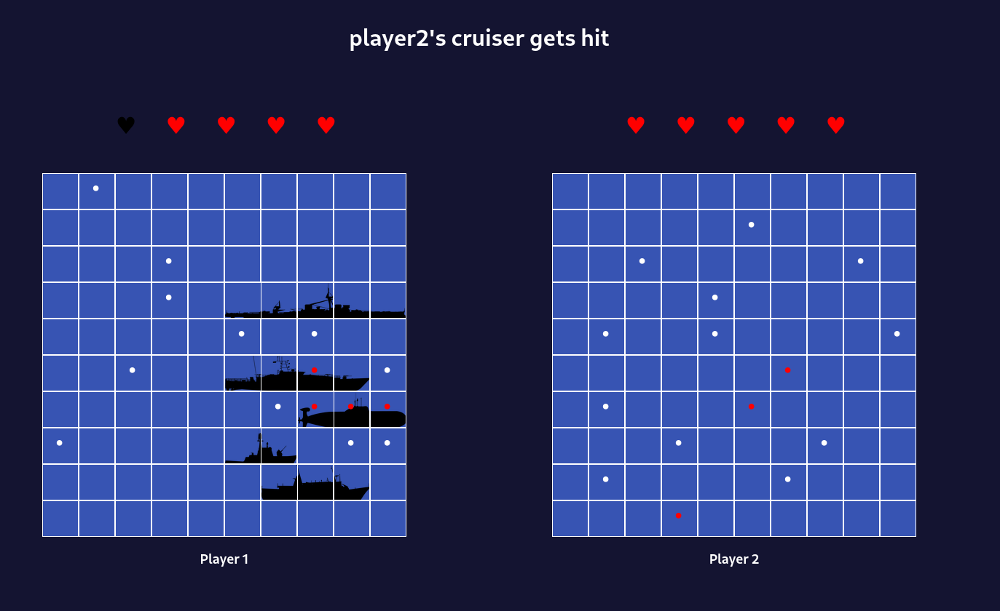

# [TheOdinProject](https://www.theodinproject.com/)

Project: Battleship



Built with typescript and using AI with Probability Density Functions and hunt algorithms

Logics inspired by [paulvanderlaken's Beating Battleships with Algorithms and AI](https://paulvanderlaken.com/2019/01/21/beating-battleships-with-algorithms-and-ai/)

## Features

- Good logic AI
- Game UI
- Drag and drop

## Installation

Clone the repository:

```bash
git clone https://github.com/Alberinea/shopping-cart.git
```

Open the project folder:

```bash
cd Batleship
```

Install all dependencies:

```bash
npm i
```

Go to dist folder:

```bash
cd dist
```

Open index.html to run the project.

## Demo

[Live Demo](https://alberinea.github.io/Battleship/)
